### taro-shop-graphql

基于[e-Commerce](https://github.com/IooBot/e-Commerce) 电商react版用taro修改支持小程序，管理页面暂未修改

使用[mock-fc](https://github.com/IooBot/mock-fc)动态更新graphql server, 只需修改所需更新的数据，随时更新graphql server

## 技术栈

React + Taro + Dva + GraphQL + Sass + ES6/ES7 + mock

## 部分截图展示

### 扫码体验


### 首页 && 商品详情

&nbsp;&nbsp;&nbsp;&nbsp;&nbsp;&nbsp;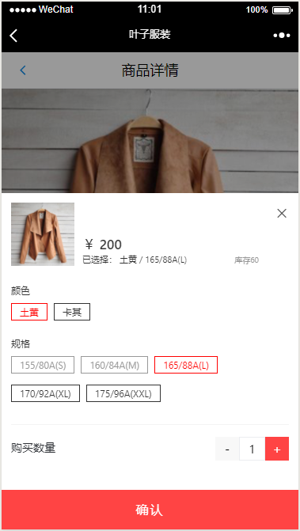

### 购物车

&nbsp;&nbsp;&nbsp;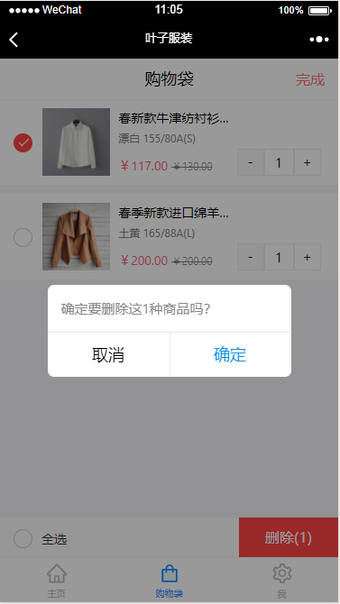

### 下单 && 支付

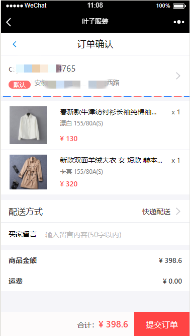&nbsp;&nbsp;&nbsp;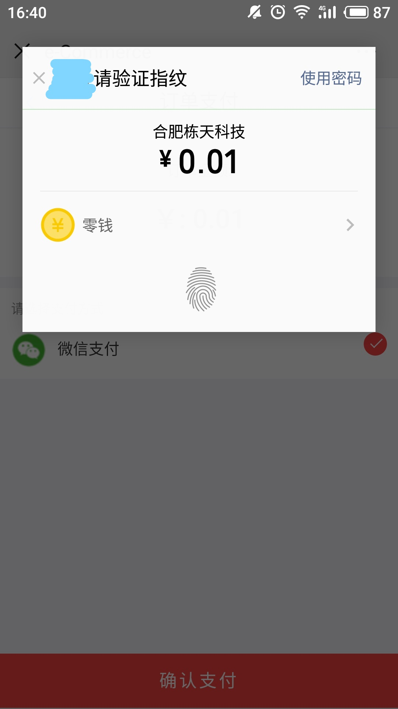

### 订单 && 详情

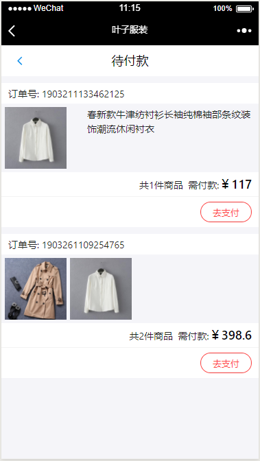&nbsp;&nbsp;&nbsp;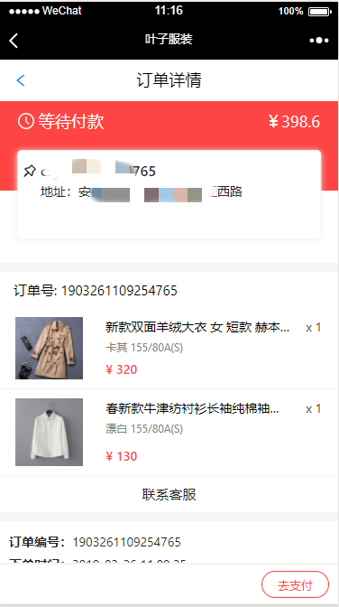

### 地址

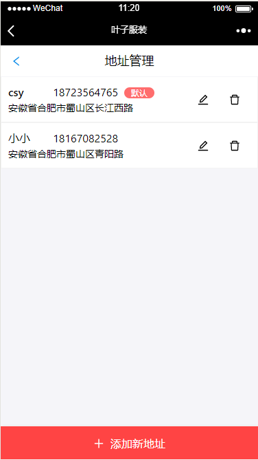&nbsp;&nbsp;&nbsp;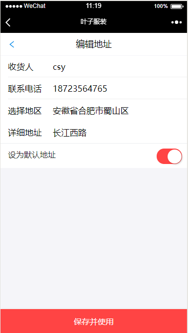

### 我的 && 店铺管理

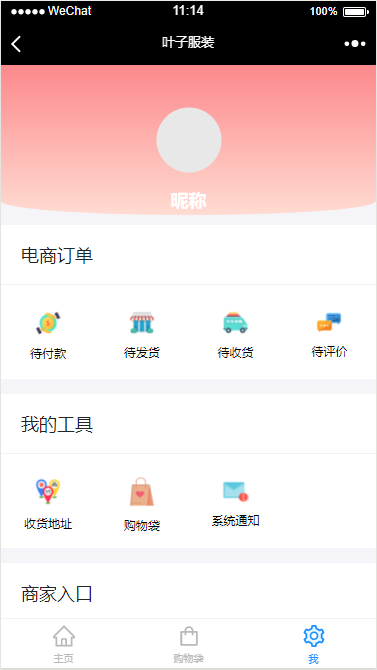&nbsp;&nbsp;&nbsp;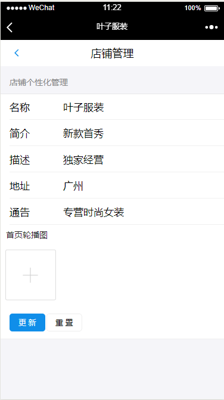

### 商品管理

&nbsp;&nbsp;&nbsp;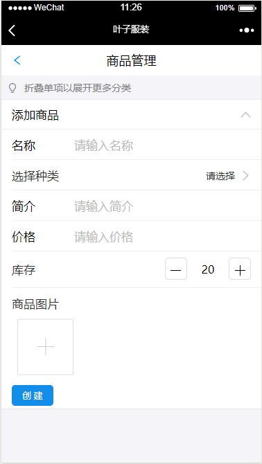

## 项目运行

```
git clone git@github.com:IooBot/taro-shop-graphql.git

cd taro-shop-graphql\client

# 使用 npm 或者 yarn 全局安装taro脚手架
npm install -g @tarojs/cli@1.2.26
yarn global add @tarojs/cli@1.2.26

# 项目依赖为1.2.26版本，如要升级，请同时升级项目依赖
# 如用1.2.26版本，请忽略这句
taro update project

# 安装项目依赖
npm install
yarn

# 微信小程序
npm run dev:weapp
yarn run dev:weapp

# H5
npm run dev:h5
yarn run dev:h5

```

## 项目说明

Dva: dva分支
开启了小程序云开发，可以关闭

# 开发文档

### Taro开发文档

> https://nervjs.github.io/taro/docs/README.html

### dva开发文档地址

> https://dvajs.com/

### 微信小程序官方文档

> https://mp.weixin.qq.com/debug/wxadoc/dev/

### GraphQL 入门

> https://graphql.cn/learn/

### Serverless 介绍

#### 腾讯云无服务器云函数 SCF

> https://cloud.tencent.com/product/scf/

#### 阿里云函数计算

> https://www.aliyun.com/product/fc?spm=5176.8142029.388261.163.41626d3e60rRSX

# 联系我们

>  如果对您有帮助，您可以点右上角 "Star" 支持一下 谢谢！ ^_^

>  我们会不断提供可参考的案例，敬请期待

>  如有您有问题或想法可以联系我们，或在 Issues 中提出

&nbsp;&nbsp;&nbsp;

# License

[MIT](LICENSE)
